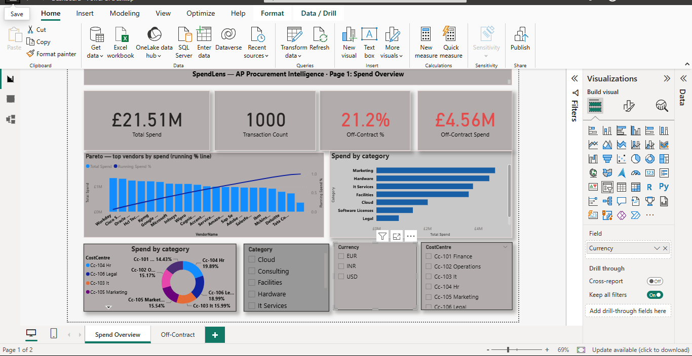
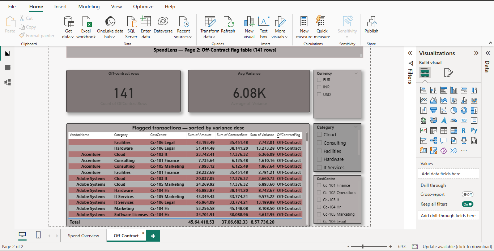

# SpendMap — AP Procurement Intelligence Dashboard

A Power BI dashboard that standardises messy vendor names, flags
off-contract spend, and surfaces Pareto concentration insights
across 1,000 synthetic accounts payable transactions.

## Business Problem

Procurement and finance teams receive AP exports with inconsistent
vendor names (e.g. "IBM", "I.B.M.", "IBM Ltd"), making spend
aggregation unreliable. Prices paid are also not systematically
checked against contracted rates, leaving off-contract overspend
invisible until invoice review. This project automates both
vendor name standardisation and off-contract flagging in Power BI.

## Data

Synthetic AP transaction file (1,000 rows) generated in Python,
with deliberately injected issues. Multi-currency (INR/USD/EUR),
8 spend categories, 6 cost centres, 20 vendors.

- 6 vendors with name variants (e.g. "Oracle Corp", "Oracle Corporation", "Oracle", "ORACLE CORP")
- 141 off-contract transactions (price > contract rate by >5%)
- Contract rate stored per row for direct variance comparison

## Approach

1. Python script generates `ap_transactions.csv` with all injections
2. Power Query: Replace Values collapses 6 vendor name groups into
   canonical names; custom column adds `OffContractFlag` and `Variance`;
   duplicate query keeps only flagged rows for the off-contract table
3. DAX: Total Spend, Off-Contract Spend, Off-Contract %, Running
   Spend % (Pareto cumulative), Avg Variance on flagged rows
4. Two-page Power BI dashboard:
   - Page 1: Spend Overview (KPIs, Pareto chart, category bars, cost centre donut)
   - Page 2: Off-Contract flag table sorted by Variance descending

## Key Findings

- Total spend: £21.51M across 1,000 transactions
- Off-contract spend: £4.56M across 141 transactions (21.2% of total)
- Hardware and Marketing are the highest off-contract categories by total variance
- Spend is evenly distributed across all 20 vendors — no strong Pareto concentration observed
- Avg variance per off-contract transaction: £6.08K
- 6 vendors had name variants that would have incorrectly split spend
  without standardisation

## Tools

Power BI Desktop · Power Query (M) · DAX · Python (data generation)

## Dashboard

